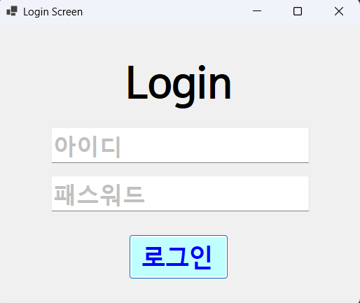
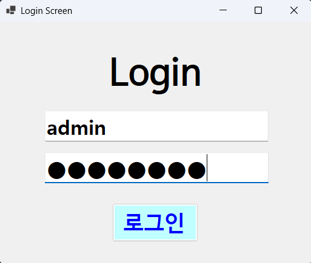
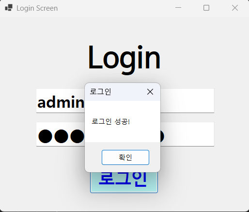
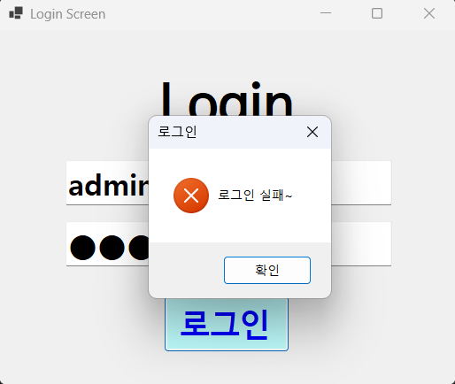
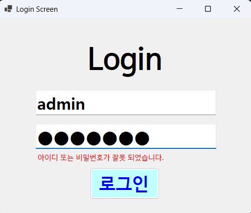

# (C# 코딩) 로그인 스크린

## 개요
- C# 프로그래밍 학습
- 1줄 소개: 아이디와 패스워드를 받아 처리하는 로그인 화면 프로그래밍
- 사용한 플랫폼:
	- C#, .NET Windows Forms, Visual Studio, GitHub
- 사용한 컨트롤:
	- Label, TextBox, Button
- 사용한 기술과 구현한 기능:
	- 이벤트 핸들링: 버튼 클릭 시 로그인 처리
	- 입력 검증: 아이디와 패스워드가 비어있는지 확인
	- 메시지 박스: 로그인 성공 또는 실패 메시지 표시

## 실행 화면 (과제1)
- 과제1 코드의 실행 스크린샷

- 과제 내용
	- 아이디와 패스워드를 입력받는 로그인 화면을 구현합니다.
	- 아이디와 패스워드 입력 힌트를 회색으로 표시합니다.
	- 로그인 버튼을 클릭하면 입력된 아이디와 패스워드를 검증합니다.
	- 로그인 성공 또는 실패 메시지를 메시지 박스로 표시합니다.

- 구현 내용과 기능 설명
	- Label, TextBox, Button 컨트롤을 사용하여 로그인 화면을 구성합니다.
	- TextBox 컨트롤을 사용하여 아이디와 패스워드를 입력받습니다. 패스워드 TextBox는 PasswordChar 속성을 설정하여 입력된 문자가 보이지 않도록 합니다.
	- Button 컨트롤을 사용하여 "로그인" 버튼을 만듭니다.
	- 로그인 버튼 클릭 이벤트 핸들러에서 아이디와 패스워드가 비어있는지 확인하고, 로그인 성공 또는 실패 메시지를 MessageBox로 표시합니다.

	## 실행 화면 (과제2)
- 과제2 코드의 실행 스크린샷

- 과제 내용
	- 아이디 또는 패스워드가 잘못 입력되었을 때 에러 메시지를 표시하는 기능을 추가합니다.
	- MessageBox를 띄우지 말고 아이디와 패스워드를 입력하는 곳에 보여줍니다.

- 구현 내용과 기능 설명
	- 로그인 버튼 클릭 이벤트 핸들러에서 아이디와 패스워드가 일치하는지 확인하고, 로그인 실패 시 에러 메시지를 Label 컨트롤에 표시하도록 수정합니다.
	- Visible 속성을 사용하여 에러 메시지 Label을 처음에는 숨기고, 로그인 실패 시에만 보이도록 설정합니다.